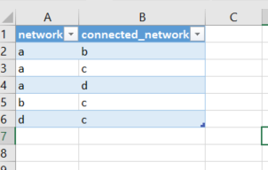
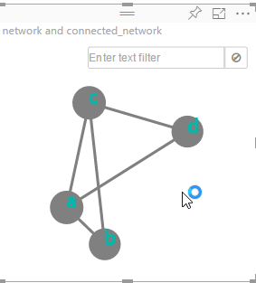

I don't know about anyone else, but I cannot stand looking at Visio diagrams, much less making them myself.  It has always felt so darn manual, and the moment I'm done, the file is usually out-of-date.  The other factor is DAMN it's expensive.  Visio does have some nice stencils and it's easy enough to use, so I see the draw to it.   

Right now, I'm staring at redesigning the way our Azure networks are setup.  When they were initially configured, a lot of thought was put into segmenting everything from everything else.   No one wants a dev to be able to reach into the production environment, so the idea was to completely segment the environments apart.   The decision was made to make virtual networks (vnets) for each component.   For instance, in the production environment, we have db-prod, web-prod, and dmz-prod vnets.   There are corresponding ones for dev and stage environments.  On top of there are some shared vnets for things like our authentication systems and jumpboxes for people to work from.   In between them, as necessary, are VPN connections.   

Very quickly, this adds up to being a saucy bowl of spaghetti.   Microsoft has since added things like Network Security Groups that make almost all of this segmenting unnecessary.  We can, for instance, create a single virtual network, and then put each of these groups into a subnet, then apply the security groups on them to limit traffic between subnets.  My goal is to make a new network layout that is as simple as possible to meet all the security requirements we need.

Interestingly enough, this is my first interaction with this team, aside from just talking to the guys about what's going on.  I have the background to do this, plus some time so I can go for it.   I'm just learning the existing environment, so I decided to make a diagram first.  Obviously, I'm not going to use Visio if I can help it.

The first thing I needed was to visualize the vnets and vpn connections.  You may remember a few years back, Facebook had this neat "Friend Wheel" thing.   It had the names of your friends on a circle, and then lines between friends who were friends with each other.   What was cool was that you could sometimes find friends who you didn't even know knew each other.   Anyway, that's what I was looking to make.   I pinged a few folks and heard of "Network Navigator", which makes a big chart that has points for the "nodes" and lines showing connections between the nodes.  While it's not my Friend Wheel idea, it does the job. 

In Excel, I created a sheet with two columns: "network" and "connectednetwork".   I went through each vnet and put in every vnet it was connected to.  The example data is shown below. This is a reflexive thing, so you don't have to have two for each one.   I went the overkill route on my real chart and just added a record for "B->A" and one for "A->B", because I didn't want to think about it much.  Once you have it, highlight the data and do a "CTRL-T" to make your selection into a table.  Save the XLS file.  I then went into PowerBI and pulled the Excel file in as a dataset.  That part is pretty self-explanatory.

 

Next, I needed to download and apply the Network Navigator visual for PowerBI.   This is downloaded from [https://app.powerbi.com/visuals/](https://app.powerbi.com/visuals/).   Save it to your Downloads folder and, in PowerBI, go to the new dataset to start a new report from it.   In the Visualizations panel, click the ellipsis icon to import visuals, and then import the file you downloaded.   Once done, you can simply click the icon for the Network Navigator and it will appear on your editing pane.

In terms of data for the widget, I just put the "network" field as my "Source Node" and "connected_networks" as my "Target Node".   The following pretty chart appeared.

From this point, you can move the little nodes around and adjust things like "gravity" and "charge" to make the node dots do different stuff.   Finally, you can just save the report and it's stored on PowerBI for good.  The nice thing with PowerBI is that you can share directly from it, at least to others who have it.  If you want to take it **NEXT LEVEL** you could save your table to a SQL database somewhere, connect that as a dataset in PowerBI, and then when you change the data, you can refresh the dataset and your diagram will automatically be redrawn. 

Now if I could just find my Friend Wheel thing I'd be 100% happy.      