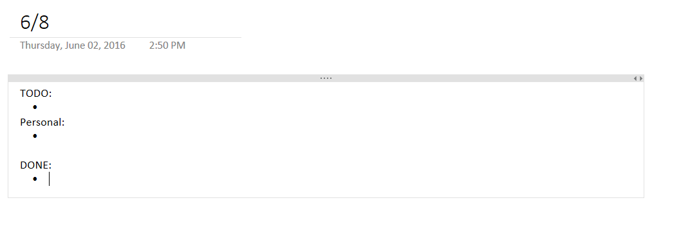

Back in April, I wrote about going back to OneNote as my "planner" of choice.  Shockingly, a couple of people read the post and I've been asked to provide more information on how I use it.  I use OneNote at work both for my personal to-do list and as a team documentation system, so I'll break this up into a section for each.

## Personal To-Do List

I settled on my to-do list format gradually, taking different things from different ideas.  I'll just post this picture of an empty daily record.

I don't know exactly how I came about this, but I think it was just taking stuff that worked for me from different sources and combining it all.  I started with a physical planner, and the Franklin-Covey way had you put a little icon at the beginning of each task.   One was for a task you would move to the next day, one was for one that was started, one finished, etc.   It was pretty nice, but I never really liked the icon approach.  

I remember working with one fella who had just a little spring-bound notepad he would carry in his shirt pocket.   He just had a list on there and would use the thing all the time.   He would scribble little notes on it, too.   It cost him probably 50 cents every few weeks.   I loved the idea, but it seemed too analog for me.

When settled with this little template, I just kept using it.  "To-do" are work-related things I need to get done, "Personal" are personal tasks I need to do, and "Done" is where I move the items as I complete them.   Every day, I make a copy of the previous day's sheet, change the date on the top, and delete the "Done" items.  I keep the sheets in a month-long section, and then keep at least 6 months of records.   This makes a really cool searchable archive of what I've done.

The other part is that I can keep little side notes for things I need later.   I can paste commands that I may use again, pull in little images or charts to keep, or whatever.   It's very handy.

One issue with this is that my team doesn't use OneNote as a planner.   We use JIRA for tracking our time and tasks.   It feels a bit redundant, but I basically take my JIRA tasks, copy them into OneNote, and work from OneNote until I have to manually update JIRA later.   I can't put my personal to-dos in JIRA, so I just copy my JIRA ones to OneNote.  

## Work 

We use OneNote as our main documentation store.   I work as a DevOps guys on a development team, but we all share the same documentation.  We've found OneNote to be really flexible, easy to sync to any computer we need, and we can even use the mobile version in a pinch.  

As with my planner usage, the team has other documentation systems in place, too.  Mostly just Confluence and SharePoint.  In the case of Confluence, I like the wiki idea, but I don't like the way it handles importing pictures or charts.   They just aren't as easy there.  I also don't like how the documents end up being very linear, top-to-bottom.   In OneNote, I can put asides on the side, which makes it much easier to read.   I won't get into my feelings on SharePoint, but it's just a a place to dump files of any format, and that just leads to a big mess.  Even knowing the other options are there, we've used OneNote so long that it's definitely the primary source of information for me.   

Anyway, those are my uses.   Hope this helps someone!
   